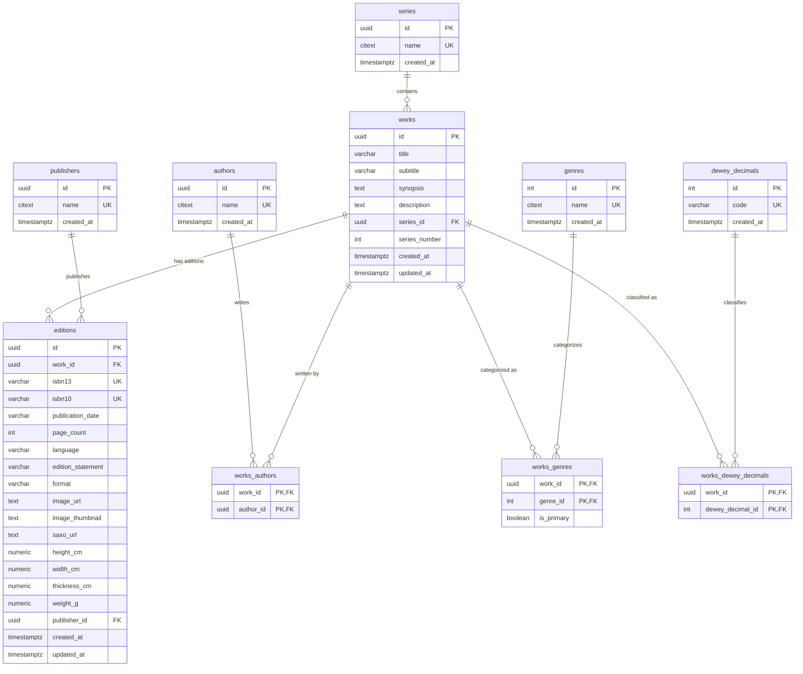

# Reveries 💫
> Developed by [Anders Lynge Ravnsbæk](https://www.linkedin.com/in/alravnsbaek/)

Reveries is a personal hobby project that I am developing in my spare time alongside job hunting. The project serves both as a way to maintain and expand my coding skills and as an opportunity to experiment with new technologies, best practices, integrations, and design patterns that can strengthen my skills and competencies as a developer.  

It is therefore both a learning project and a product I personally want to use to support my passion for reading books and one I look forward to putting into use.  

### Vision 🔭
Reveries aims to be a digital book hub where you can build and organize your own collection in the form of a virtual bookshelf.  

The goal is to create a platform that makes it easier to get an overview of the books you own, provides insights into your reading habits, and presents metadata and statistics about which books you have read and which are still waiting to be explored - and who knows what future features will be implemented.  

The project is being developed as a fullstack application, hosted on a Raspberry Pi and accessible through my private network. This makes it a complete learning environment, covering everything from backend and database to frontend and deployment.  

### Bookscanner
For easier creation of books in the system, a book scanner has been made to make it faster and easier to add all the books in your shelf. The scanner scans the ISBN barcode on the book, and the backend quickly retrieves the book metadate from the external APIs.

### Project Plan 🎯
The plan for the project is outlined below. The choice of technologies is primarily driven by the desire to gain hands-on experience with widely used and relevant tools from the real world, not necessarily because they represent the most optimal solution for this particular application.  

- **Backend**
  - [x] **C# / .NET API**  
    The business logic is developed with a focus on following SOLID principles and Clean Architecture to ensure scalable and maintainable code.  
  - [x] **Dapper**  
    Used as a micro-ORM instead of EF-Core to gain more control over SQL and create a closer connection between code and database.  
  - [x] **External APIs - ISBNDB and Google Books**  
    Integration with external APIs that provides book data, allowing new titles to be added quickly with rich metadata.  

- **Frontend**
  - [ ] **TypeScript and Vue**  
    A modern and responsive interface built with React to gain practical experience with one of the most widely adopted frontend libraries.  

- **Database**
  - [x] **PostgreSQL**  
    Chosen to build experience with one of the most popular relational databases, also widely used in large-scale projects.  

- **Cache**
  - [x] **Redis**  
    Implemented to optimize response times and provide a faster, more responsive user experience. Using a Cache-Aside strategy, data is cached in memory and refreshed from the database when needed.

- **CI/CD**
  - [x] **Docker and GitHub Actions**  
    Pipelines automatically package new builds into Docker images and deploy them to the Raspberry Pi, ensuring the application always runs the latest version.  

### Database Schema 📋
Below is an ER diagram of the current entities in the project. All tables live in the
`catalog` schema and are provisioned by versioned **DbUp** migrations
(`src/Reveries.Persistence/Migrations/Scripts`). The catalog is split into a **Work** (the
abstract book) and its **Editions** (concrete physical releases); name columns use `citext`
for case-insensitive uniqueness, and `genres`/`dewey_decimals` use identity keys.

```mermaid
erDiagram
    works {
        uuid id PK
        varchar title
        varchar subtitle
        text synopsis
        text description
        uuid series_id FK
        int series_number
        timestamptz created_at
        timestamptz updated_at
    }

    editions {
        uuid id PK
        uuid work_id FK
        varchar isbn13 UK
        varchar isbn10 UK
        varchar publication_date
        int page_count
        varchar language
        varchar edition_statement
        varchar format
        text image_url
        text image_thumbnail
        text saxo_url
        numeric height_cm
        numeric width_cm
        numeric thickness_cm
        numeric weight_g
        uuid publisher_id FK
        timestamptz created_at
        timestamptz updated_at
    }

    authors {
        uuid id PK
        citext name UK
        timestamptz created_at
    }

    publishers {
        uuid id PK
        citext name UK
        timestamptz created_at
    }

    series {
        uuid id PK
        citext name UK
        timestamptz created_at
    }

    genres {
        int id PK
        citext name UK
        timestamptz created_at
    }

    dewey_decimals {
        int id PK
        varchar code UK
        timestamptz created_at
    }

    works_authors {
        uuid work_id PK, FK
        uuid author_id PK, FK
    }

    works_genres {
        uuid work_id PK, FK
        int genre_id PK, FK
        boolean is_primary
    }

    works_dewey_decimals {
        uuid work_id PK, FK
        int dewey_decimal_id PK, FK
    }

    works ||--o{ editions : "has editions"

    authors ||--o{ works_authors : "writes"
    works ||--o{ works_authors : "written by"

    works ||--o{ works_genres : "categorized as"
    genres ||--o{ works_genres : "categorizes"

    works ||--o{ works_dewey_decimals : "classified as"
    dewey_decimals ||--o{ works_dewey_decimals : "classifies"

    publishers ||--o{ editions : "publishes"
    series ||--o{ works : "contains"
```
