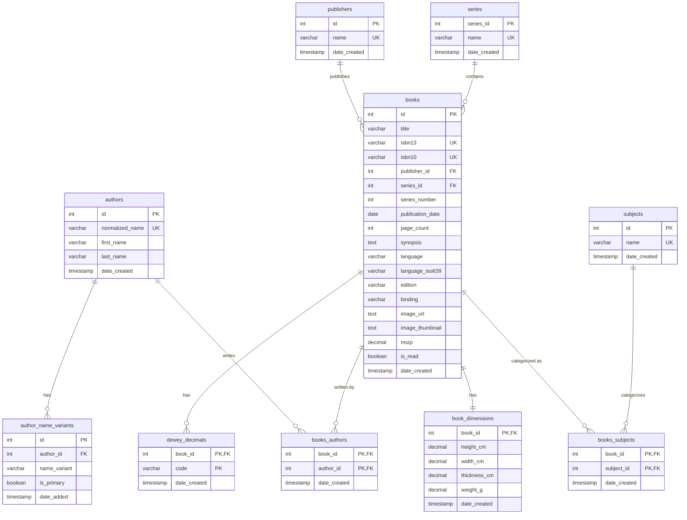

# Reveries 💫
> Developed by [Anders Lynge Ravnsbæk](https://www.linkedin.com/in/alravnsbaek/)

Reveries is a personal hobby project that I am developing in my spare time alongside job hunting. The project serves both as a way to maintain and expand my coding skills and as an opportunity to experiment with new technologies, best practices, integrations, and patterns that can strengthen my competencies as a developer.  

It is therefore both a learning project and a product I personally want to use to support my passion for reading books—and one I look forward to putting into practice.  

### Vision 🔭
Reveries aims to be a digital book hub where you can build and organize your own collection in the form of a virtual bookshelf.  

The goal is to create a platform that makes it easier to get an overview of the books you own, provides insights into your reading habits, and presents metadata and statistics about which books you have read and which are still waiting to be explored.  

The project is being developed as a fullstack application, hosted on a Raspberry Pi and accessible through my private network. This makes it a complete learning environment, covering everything from backend and database to frontend and deployment.  

### Project Plan 🎯
The plan for the project is outlined below. The choice of technologies is primarily driven by the desire to gain hands-on experience with widely used and relevant tools from the real world, not necessarily because they represent the most optimal solution for this particular application.  

- **Backend**
  - [ ] **C# / .NET API**  
    The business logic is developed with a focus on SOLID principles and Clean Architecture to ensure scalable and maintainable code.  
  - [x] **Dapper**  
    Used as a micro-ORM instead of EF-Core to gain more control over SQL and create a closer connection between code and database.  
  - [x] **ISBNDB**  
    Integration with an external API that provides book data, allowing new titles to be added quickly with rich metadata.  

- **Frontend**
  - [ ] **TypeScript and React**  
    A modern and responsive interface built with React to gain practical experience with one of the most widely adopted frontend libraries.  

- **Database**
  - [x] **PostgreSQL**  
    Chosen to build experience with one of the most popular relational databases, also widely used in large-scale projects.  

- **Cache**
  - [ ] **Redis**  
    Implemented to optimize response times and provide a faster, more responsive user experience.  

- **CI/CD**
  - [ ] **Docker and GitHub Actions**  
    Pipelines automatically package new builds into Docker images and deploy them to the Raspberry Pi, ensuring the application always runs the latest version.  

### Technologies 🚀
- C# / .NET  
- Dapper  
- ISBNDB API  
- TypeScript / React  
- PostgreSQL  
- Redis  
- Docker  
- GitHub Actions  

### Database Schema 📋
Below is an ER diagram of the current entities in the project.  
The diagram provides an overview of the tables, their relationships, and their fields. It serves as the foundation for the database schema implementation and helps keep the structure organized as the project grows.  
  

